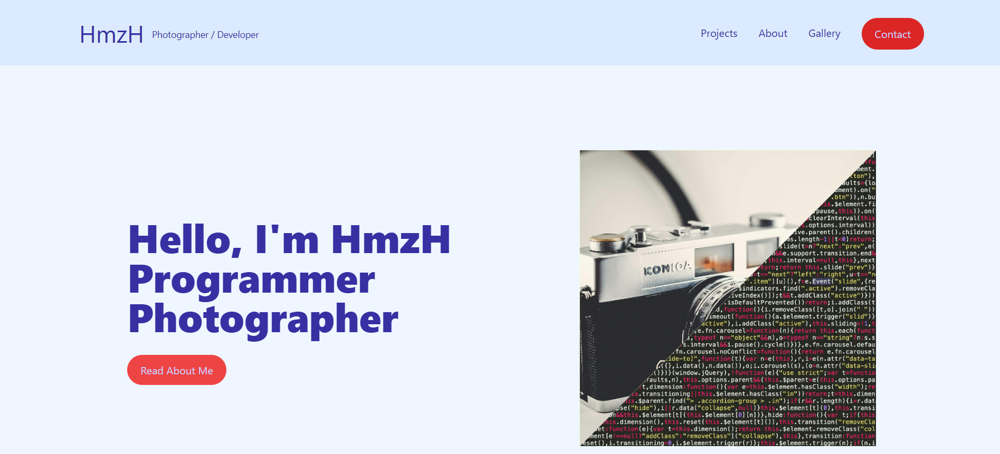
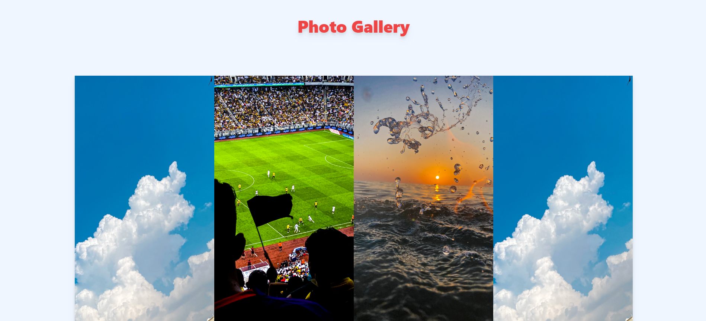
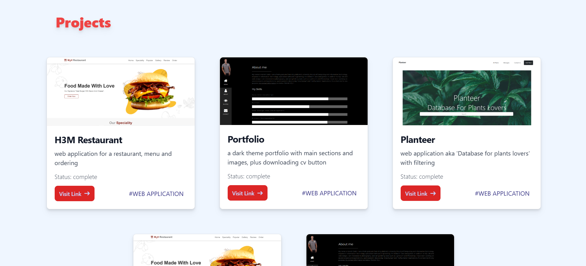

# My Portfolio 
## Rewritten in React.JS for practice 

#### [hmzhfolio](https://hmzhfolio.up.railway.app/) this is my main portfolio
#### This Portfolio has been designed and deployed previously, but I needed to rewrite it in react to get hand-on practice on React.JS static web application.  

## Upcoming Upgrades to the page

- Add About me Page 
  - Main component 
  - Tools stack component
  - Skills component
  - contact component
- Add Footer Component
- Transform the application from static to an interactive page for CRUD operations on certain data
- Add an admin dashboard to access projects, photos, tools stack, and skills
- configure React Router to rout between pages

## Wireframes

